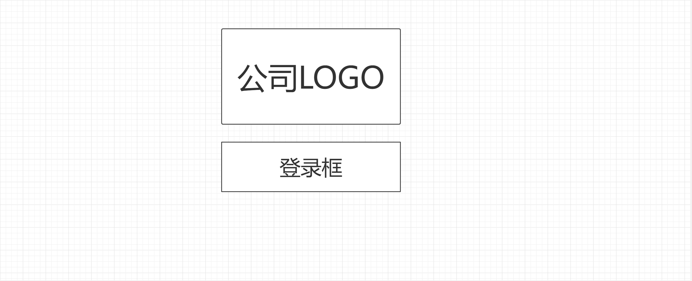
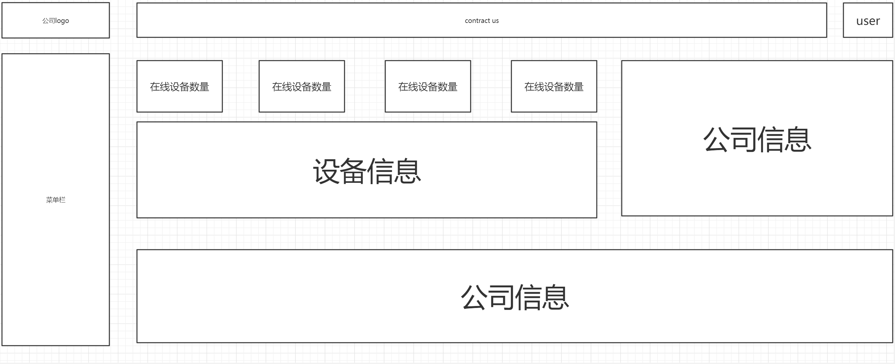

# 网站设计文件

## 0 文件夹
```
.
|
|------asset "放静态资源文件"
|
|------components "放置公共子组件"
|      |------Navbar    "导航栏"
|      |------SideBar   "侧边栏"
|
|------layout "三大界面"
|      |
|      |------auth-layout   "认证界面布局。包括注册，登录and密码找回"
|      |------admin-layout  "用户主界面布局"
|      |------404           "404 NOT FOUND"
|
|------views
|      |------auth
|      |      |------login "登陆组件"
|      |------admin
|             |------overview         "概览"
|             |------devManagement    "设备管理"
|             |------dataCenter       "数据中心"
|
|------store  "全局变量"
|
|------router "路由文件夹"
|            
```

## 1 登录界面

### 1 登陆界面大图



### 1.2 需要做的事情

- 使用API，log 将token，username，uid 存入store。

### 1.3 全局变量（store）情况

- token:string
- username:string
- uid:number

## 2 主页

### 2.1 主页大图



### 2.2 需要做的事情

- 使用API获取设备的详细信息，同步在线情况，并存入store中
  详细信息存储：

```json
""
```

